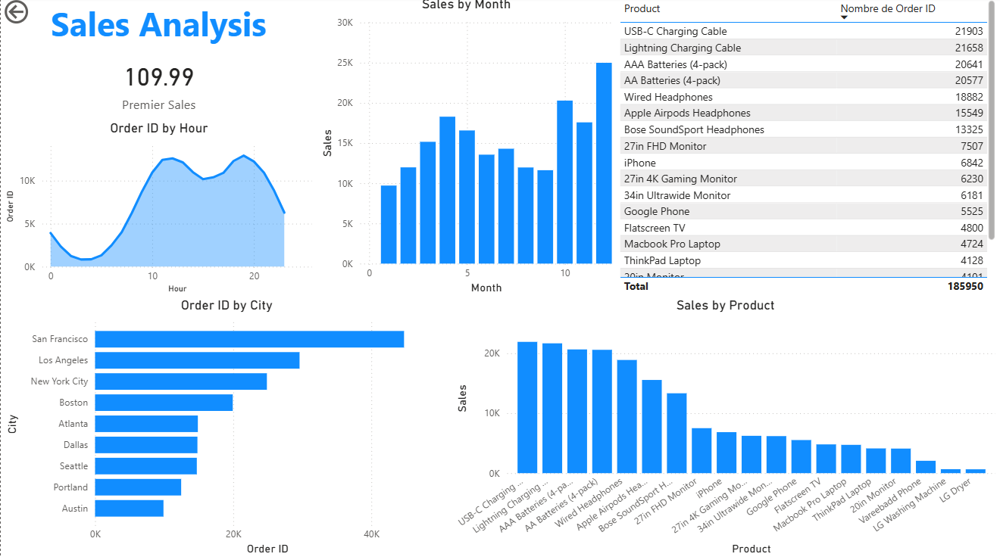

# Sales Analysis with Python & Power BI

# 📌 Project Overview
This project focuses on analyzing sales data using Python and building an interactive Power BI dashboard to support data-driven decision-making.

## 🛠️ Tools & Technologies
- Python (Pandas, NumPy, Matplotlib)
- Power BI
- CSV

## 🔍 Key Analysis
- Data cleaning and preprocessing
- Exploratory Data Analysis (EDA)
- KPI calculation (Revenue, Sales Volume, Growth)
- Sales performance analysis by product, region, and time

## 📊 Dashboard Preview

## 📈 Key Insights
- Identification of top-performing products
- Detection of Hours sales trends
- Regional performance comparison

## 📁 Project Structure
See folders: data/, notebooks/, powerbi/

## 🚀 Author
Cedrick Saleh Ngolikwenda
Cedrick the Analyst
